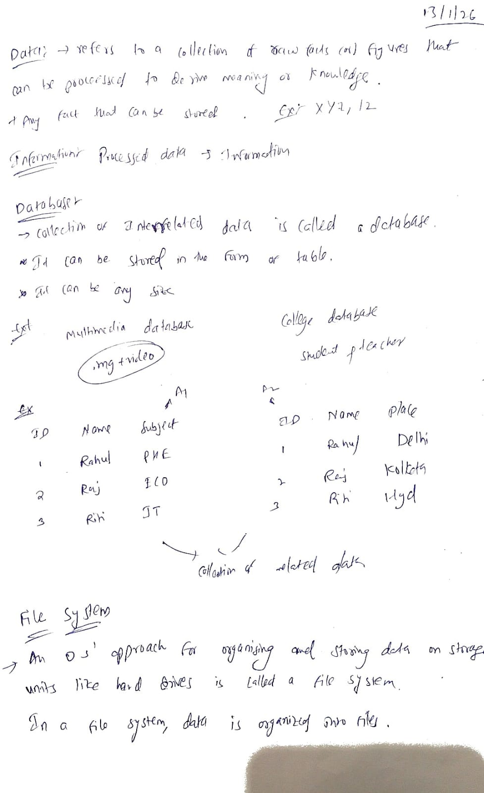
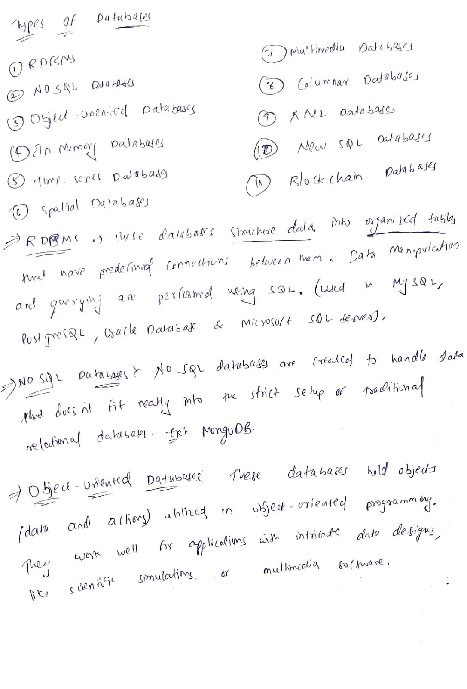
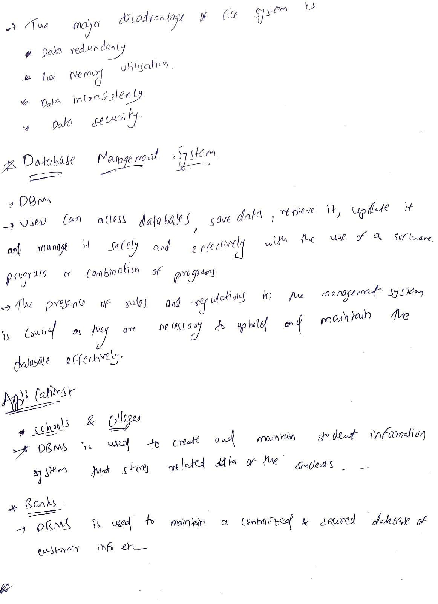
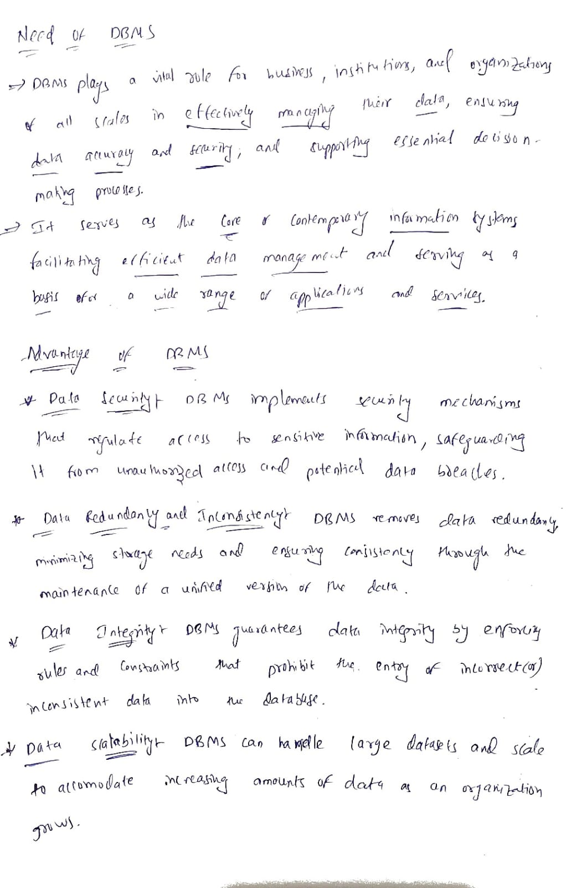

# Introduction to DBMS

Notes based on Striver / takeUforward DBMS sheet.

## Topics Covered (4 / 7)
- Data, Database and File System ✅
- Types of Database ✅
- What is DBMS and its applications ✅
- Need, advantages and disadvantages of DBMS ✅
- Data Abstraction ⏳
- DBMS Architecture ⏳
- 3-tier Architecture ⏳

---

## Notes

### 1. Data, Database and File System

---

### 2. Types of Database

---

### 3. What is DBMS and its applications

---

### 4. Need, advantages and disadvantages of DBMS
(04.1-disadvantagesjpeg)
